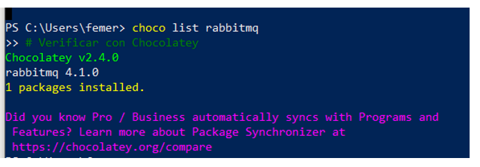
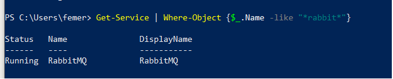
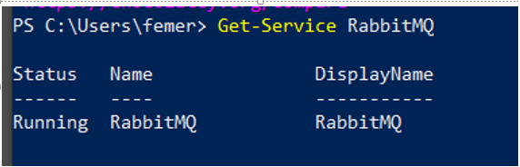
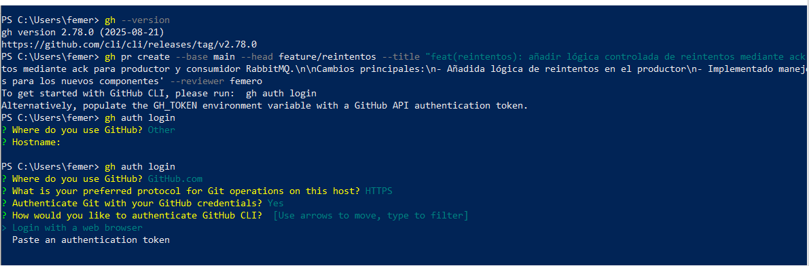

# RabbitMQ Chocolatey + Mejoras
## En PowerShell como administrador Installing Choco
```sh
Set-ExecutionPolicy Bypass -Scope Process -Force; [System.Net.ServicePointManager]::SecurityProtocol = [System.Net.ServicePointManager]::SecurityProtocol -bor 3072; iex ((New-Object System.Net.WebClient).DownloadString('https://community.chocolatey.org/install.ps1'))
```
## Buscar paquetes
```sh
choco search nombre_paquete
```
##  Instalar software
```sh
choco install git
```
```sh
choco install nodejs
```
```sh
choco install python
```

##  Listar software instalado
```sh
choco list --local-only
```

## Actualizar un paquete
```sh
choco upgrade git
```

## Actualizar todos los paquetes
```sh
choco upgrade all
```

## Desinstalar
```sh
choco uninstall git
```

## Ver información de un paquete
```sh
choco info nodejs
```

## Instalar múltiples paquetes
```sh
choco install git nodejs python vscode -y
```

## Ver configuración
```sh
choco config list
```

## Crear tu propio paquete
```sh
choco new mipaquete
```

## Paso A Paso
```sh
choco install rabbitmq -y
```


```sh
choco list rabbitmq
```

Agregar al PATH del sistema (como administrador)
```sh
$env:PATH += ";C:\Program Files\RabbitMQ Server\rabbitmq_server-4.1.0\sbin"
```

```sh
Start-Service RabbitMQ
```
```sh
rabbitmq-service start
```


Como administrador
```sh
choco uninstall rabbitmq erlang -y
```
```sh
choco install erlang -y
```
```sh
choco install rabbitmq -y
```

Verificar que ERLANG_HOME está configurado
```sh
$env:ERLANG_HOME
```

# Si no existe, configurarlo
```sh
[Environment]::SetEnvironmentVariable("ERLANG_HOME", "C:\Program Files\Erlang OTP", "Machine")
```

## ♥SOLUTION
Detener todos los procesos relacionados
```sh
Stop-Service RabbitMQ -Force
```
```sh
taskkill /f /im erl.exe
```
```sh
taskkill /f /im epmd.exe
```
Limpiar datos temporales
```sh
Remove-Item "C:\Users\$env:USERNAME\AppData\Roaming\RabbitMQ" -Recurse -Force -ErrorAction SilentlyContinue
```

Reinstalar el servicio
```sh
cd "C:\Program Files\RabbitMQ Server\rabbitmq_server-*\sbin"
```

```sh
.\rabbitmq-service.bat remove
```

```sh
.\rabbitmq-service.bat install
```

Navegar al directorio sbin
```sh
cd "C:\Program Files\RabbitMQ Server\rabbitmq_server-*\sbin"
```

Iniciar manualmente (esto te mostrará errores detallados)
```sh
.\rabbitmq-server.bat
```

Agregar al PATH del sistema (como administrador)
```sh
$env:PATH += ";C:\Program Files\RabbitMQ Server\rabbitmq_server-4.1.0\sbin"
```

```sh
rabbitmqctl status
```

En el directorio sbin de RabbitMQ
```sh
rabbitmq-plugins enable rabbitmq_management
```

```sh
rabbitmqctl status
```

Acceder a la interfaz web
http://localhost:15672

```sh
Usuario: guest, Contraseña: guest
```

```sh
rabbitmqctl list_queues
```


```sh
Get-Service RabbitMQ
```


Borrar cola en powershell
```sh
rabbitmqctl delete_queue myQueue.bootcamp
```

Crear cola en powershell
```sh
$headers = @{
    "Authorization" = "Basic " + [Convert]::ToBase64String([Text.Encoding]::ASCII.GetBytes("guest:guest"))
    "Content-Type" = "application/json"
}

$body = @{
    durable = $true
    auto_delete = $false
} | ConvertTo-Json

Invoke-RestMethod -Uri "http://localhost:15672/api/queues/%2F/myQueue.bootcamp" -Method PUT -Headers $headers -Body $body
```


```sh
choco upgrade rabbitmq
```
```sh
choco uninstall rabbitmq
```

Iniciar el servicio 
```sh
rabbitmq-service start
```

Detener el servicio  
```sh
rabbitmq-service stop
```

Habilitar el plugin de management (interfaz web)
```sh
rabbitmq-plugins enable rabbitmq_management
```

Crear un usuario
```sh
rabbitmqctl add_user usuario contraseña
```

Dar permisos de administrador
```sh
rabbitmqctl set_user_tags usuario administrator
```

Python 
```sh
import pika

connection = pika.BlockingConnection(pika.ConnectionParameters('localhost'))
channel = connection.channel()

channel.queue_declare(queue='mi_cola')

channel.basic_publish(exchange='', routing_key='mi_cola', body='Hola mundo!')

def callback(ch, method, properties, body):
    print(f"Recibido: {body}")

channel.basic_consume(queue='mi_cola', on_message_callback=callback, auto_ack=True)
channel.start_consuming()
```

Interfaz Web

```sh
Accede a http://localhost:15672 (usuario: guest, contraseña: guest por defecto)
```

```sh
git checkout -b feature/reintentos
```
```sh
git pull origin main
```
```sh
git push --set-upstream origin feature/reintentos
```
```sh
git add .
```
```sh
git commit -m "feat(reintentos): añadir lógica controlada de reintentos mediante ack para productor y consumidor RabbitMQ"
```
```sh
git push
```

```sh
choco install gh
```
```sh
gh auth login
```
```sh
gh pr create --base main --head feature/reintentos --title "feat(reintentos): añadir lógica controlada de reintentos mediante ack para productor y consumidor RabbitMQ" --body $'Implementa lógica controlada de reintentos mediante ack para productor y consumidor RabbitMQ.\n\nCambios principales:\n- Añadida lógica de reintentos en el productor\n- Implementado manejo de ACK/NACK en el consumidor\n- Configuración de dead letter queues\n- Tests unitarios para los nuevos componentes' --reviewer femero
```
```sh
git log --oneline -3  # Ver últimos 3 commits
```
```sh
git show HEAD         # Ver detalles del último commit
```
